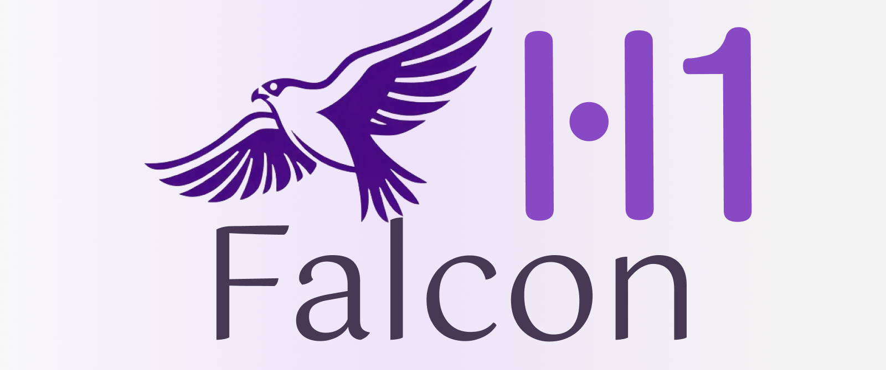
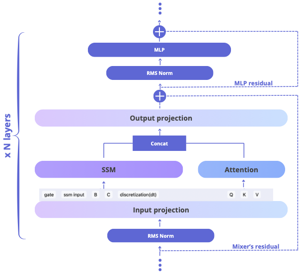
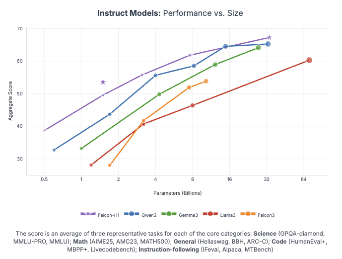
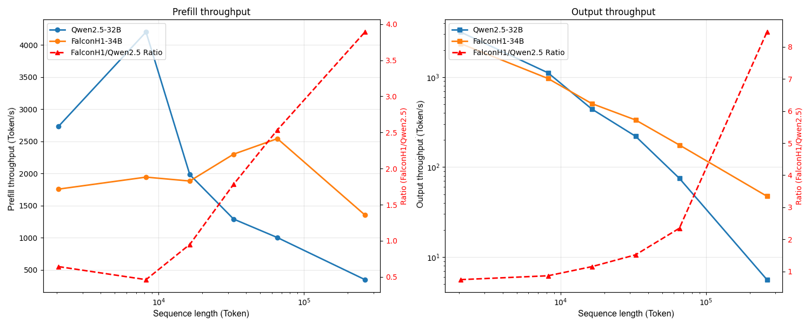

<p align="center">
  
</p>

<p align="center">
  <a href="https://chat.falconllm.tii.ae/">🦅 <strong>Falcon-H1 Chat</strong></a> |
  <a href="https://huggingface.co/collections/tiiuae/falcon-h1-6819f2795bc406da60fab8df">🤗 <strong>Hugging Face</strong></a> |
  <a href="https://arxiv.org/abs/2507.22448">📄 <strong>Paper </strong></a> |
  <a href="https://falcon-lm.github.io/blog/falcon-h1/">📰 <strong>Blog</strong></a> |
  <a href="https://tiiuae.github.io/Falcon-H1/">📄 <strong>Documentation</strong></a> |
  <a href="https://huggingface.co/spaces/tiiuae/Falcon-H1-playground">🖥️ <strong>Hugging Face Demo</strong></a> |
  <a href="https://discord.gg/trwMYP9PYm">💬 <strong>Discord</strong></a>
</p>

## News

- 10/02/2025 [Falcon-H1 series](https://huggingface.co/collections/tiiuae/falcon-h1-6819f2795bc406da60fab8df) is now [integrated into SGLang](https://github.com/sgl-project/sglang)! 
- 09/22/2025 [Falcon-H1 series](https://huggingface.co/collections/tiiuae/falcon-h1-6819f2795bc406da60fab8df) is now [integrated into MLX](https://github.com/ml-explore/mlx-lm/)!
- 07/31/2025 The [Technical Report](https://arxiv.org/abs/2507.22448) of Falcon-H1 is now released! 
- 07/09/2025 [Falcon-H1 series](https://huggingface.co/collections/tiiuae/falcon-h1-6819f2795bc406da60fab8df) is now [integrated into llama.cpp](https://github.com/ggml-org/llama.cpp)!
- 06/30/2025 [Falcon-H1 series](https://huggingface.co/collections/tiiuae/falcon-h1-6819f2795bc406da60fab8df) is now [integrated into several fine-tuning frameworks (axolotl, llama-factory, unsloth)](https://tiiuae.github.io/Falcon-H1/finetuning/)! 
- 05/21/2025 [Falcon-H1 series](https://huggingface.co/collections/tiiuae/falcon-h1-6819f2795bc406da60fab8df) is finally out!
---

## 🚀 Introduction

We are excited to introduce **Falcon-H1**, the latest evolution in the Falcon family of large language models. Built upon an advanced **hybrid architecture**—where each block integrates both **State Space Models (SSMs)** and **Attention Mechanisms**, these models span a wide range of scales, from **500 million to 34 billion parameters**, making them suitable for both lightweight inference on edge devices and large-scale deployments in data centers.

**Falcon-H1** was initially trained with support for **18 core languages**, with scalability to **100+ languages**, achieving state-of-the-art multilingual and reasoning performances in **instruction following**, **maths**, **coding**, and **multilingual tasks**.

---

## ✨ Key Highlights

Built by the **Technology Innovation Institute (TII)** in Abu Dhabi, **Falcon-H1** is the latest step in pushing the frontier of hybrid transformer design.

<p align="center">
  
</p>

### 🧩 Innovative Hybrid Architecture 
Attention and Mamba2 heads are combined in parallel within our hybrid mixer block. Importantly, the amount of attention and mamba heads can be adjusted independently, allowing for an optimal attention ans SSM ratio. This hybrid design enables faster inference, lower memory usage, and strong geenralization aceoss tasks.

### 🧠 Wide Range of Model Sizes 
Models available at multiple scales or variants: **0.5B**, **1.5B**, **1.5B-Deep**, **3B**, **7B**, and **34B** parameters, supporting diverse usages and deployment scenarios, from edge devices to large-scale systems.

### 🌐 Multilingual by Design 
Native training in **18 languages**, including Arabic (ar), Czech (cs), German (de), English (en), Spanish (es), French (fr), Hindi (hi), Italian (it), Japanese (ja), Korean (ko), Dutch (nl), Polish (pl), Portuguese (pt), Romanian (ro), Russian (ru), Swedish (sv), Urdu (ur), and Chinese (zh) — with scalability to 100+ languages, thanks to our **multilingual tokenizer** trained on diverse language datasets, with strong **zero-shot translation** and **instruction-following** abilities.

### 🔥 Compact Models, Big Performance 
Falcon-H1-0.5B delivers performance on par with typical 7B models from 2024, while Falcon-H1-1.5B-Deep rivals many of the current leading 7B–10B models. Each Falcon-H1 model is designed to match or exceed the performance of models at least twice its size, making them ideal for low-resource and edge deployments without compromising on capability.

### 📏 256K Context Support 
Falcon-H1 models support up to 256K context length, enabling applications in long-document processing, multi-turn dialogue, and long-range reasoning, with exceptional long context performance and greater computational and memory efficiency, Falcon-H1 provides a great balance between performance and resource cost. 

### 🔬 Robust Data and Training Strategy
Falcon-H1 employs a redesigned training approach that maximizes the value of high-quality but limited data. Additionally, the training process scales smoothly across model sizes through a customized **Maximal Update Parametrization** ($\mu P$) recipe, specifically adapted for this novel architecture.

### 🤖 Wide Support in Open-source Eco-system 
Falcon-H1 is compatible with most major training, inference and deployment frameworks, such as **Llama-Factory**, **Unsloth**, **vLLM**, **SGLang**, **Hugging Face Transformers**, **llama.cpp** and **MLX** — with more coming soon.


---

## 📊 Performance and Throughput

A detailed dynamic evaluation report is provided in our [blogpost](https://falcon-lm.github.io/blog/falcon-h1/) and [technical report](https://arxiv.org/abs/2507.22448).

<p align="center">
  
</p>

<p align="center">
  
</p>

1. 🏆 We show that Falcon-H1 models achieve state-of-the-art performance in most benchmarks (reasoning, maths, coding, in-context learning, and more), outperforming leading open models double their sizes.
2. 🚀 Falcon-H1-34B achieves up to a **4x improvement in input throughput** and an **8x speedup in output throughput**, compared to similar size Transformer models (Qwen2.5-32B).

---


## 🧭 Where to Start?

We provide the following documentation and resources to begin working with Falcon-H1:

- 💬 **Quick Deploy**: Try Falcon-H1 instantly using our hosted [Chat Interface](https://chat.falconllm.tii.ae/auth) or the [Live Demo from Hugging Face](https://huggingface.co/spaces/tiiuae/Falcon-H1-playground)
- 🛠️ **Inference Toolkits**: Compatible out-of-the-box with **vLLM**, **SGLang**, **Transformers**, and **llama.cpp**. 👉 [Deployment Instructions](https://github.com/tiiuae/Falcon-H1/blob/main/docs/deployment.md). Other runtimes are in progress.
- ⚙️ **Fine-tuning**: Compatible with most frameworks based on Hugging Face Transformers library, out-of-the-box with **OUMI**, **Llama-Factory**, etc. 👉 [Fine-Tuning Guidelines](https://github.com/tiiuae/Falcon-H1/blob/main/docs/finetuning.md). More framework support coming soon!
- 💻 **Local Setup**: Full **GGUF** and **HF** formats available. Run it efficiently on both GPU and CPU.
- 🔬 **Research**: Learn more about our novel hybrid design in the [Falcon-H1 technical report](https://arxiv.org/abs/2507.22448).

---

## ⚡ Inference

> 💡 **Tip:** For optimal performance, always use **`torch.bfloat16`** instead of **`torch.float16`**; The recommended **`model temperature`** is **`0.1`** - higher than that, model's performance may largely drop.

Make sure to install the latest version of `transformers` or `vllm`, eventually install these packages from source:

```bash
pip install git+https://github.com/huggingface/transformers.git
```

Refer to [the official vLLM documentation for more details on building vLLM from source](https://docs.vllm.ai/en/latest/getting_started/installation/gpu.html#build-wheel-from-source).

### 🤗 Transformers
[Transformers](https://github.com/huggingface/transformers) is a library of pretrained natural language processing for inference and training.
Refer to the snippet below to run H1 models using 🤗 transformers:

```python
import torch
from transformers import AutoModelForCausalLM, AutoTokenizer

# Load the model
model_id = "tiiuae/Falcon-H1-1.5B-Base"
model = AutoModelForCausalLM.from_pretrained(
    model_id,
    torch_dtype=torch.bfloat16,
    device_map="auto"
)

# Load the tokenizer
tokenizer = AutoTokenizer.from_pretrained(model_id)

# Perform text generation below
```

### 🚄 vLLM

[vLLM](https://github.com/vllm-project/vllm) is a high-throughput and memory-efficient inference and serving engine for LLMs.
To run Falcon-H1 models with the recommended precision and sampling defaults:

```bash
# pip install vllm
vllm serve tiiuae/Falcon-H1-1.5B-Instruct \
  --tensor-parallel-size 2 \
  --data-parallel-size 1 \
  --dtype bfloat16 \
  --port 8000
```

Then send requests with the target temperature:

```bash
curl http://127.0.0.1:8000/v1/chat/completions \
  -H "Content-Type: application/json" \
  -d '{
    "model": "tiiuae/Falcon-H1-1.5B-Instruct",
    "temperature": 0.1,
    "messages": [
      {"role": "system", "content": "You are Falcon-H1."},
      {"role": "user", "content": "Give me a fun fact about falcons."}
    ]
  }'
```

### ⚙️ SGLang

[SGLang](https://github.com/sgl-project/sglang) provides a high-performance serving runtime with native Falcon-H1 kernels.
Follow the steps below to spin up a Falcon-H1 endpoint:

```bash
# 1. Install the runtime (requires an NVIDIA GPU with FlashInfer-compatible CUDA drivers)
pip install uv
uv pip install "sglang[all]>=0.5.3"

# 2. Launch Falcon-H1 with SGLang (replace <your_token> with a Hugging Face token)
HF_TOKEN=<your_token> python -m sglang.launch_server \
  --model-path tiiuae/Falcon-H1-7B-Instruct \
  --dtype bfloat16 \
  --host 0.0.0.0 \
  --port 30000 \
  --trust-remote-code
```

You can now call the OpenAI-compatible endpoint exposed on `http://localhost:30000`:

```bash
curl http://localhost:30000/v1/chat/completions \
  -H "Content-Type: application/json" \
  -d '{
    "model": "tiiuae/Falcon-H1-7B-Instruct",
    "temperature": 0.1,
    "messages": [
      {"role": "system", "content": "You are Falcon-H1."},
      {"role": "user", "content": "Give me a fun fact about falcons."}
    ]
  }'
```

### 🔧 llama.cpp

Falcon-H1 is now natively supported into `llama.cpp` !

All official GGUF files can be found on [our official Hugging Face collection](https://huggingface.co/collections/tiiuae/falcon-h1-6819f2795bc406da60fab8df).

---

#### 1. Prerequisites

* **CMake** ≥ 3.16
* A **C++17**-compatible compiler (e.g., `gcc`, `clang`)
* **make** or **ninja** build tool
* (Optional) **Docker**, for OpenWebUI integration

---

#### 2. Clone & Build

```bash
# Clone the Falcon-H1 llama.cpp fork
git clone https://github.com/ggml-org/llama.cpp
cd llama.cpp

# Create a build directory and compile
mkdir build && cd build
cmake ..         # Configure the project
make -j$(nproc)  # Build the binaries
```

> Tip: For GPU acceleration, refer to the llama.cpp [GPU guide](https://github.com/ggerganov/llama.cpp#gpu-support).

---

#### 3. Download a GGUF Model

Fetch the desired Falcon-H1 checkpoint from Hugging Face’s collection:

```bash
# Example: download the 1B Instruct model
wget https://huggingface.co/tiiuae/Falcon-H1-1.5B-Instruct-GGUF/resolve/main/Falcon-H1-1.5B-Instruct-Q5_K.gguf \
     -P models/
```

> All available GGUF files: [https://huggingface.co/collections/tiiuae/falcon-h1-6819f2795bc406da60fab8df](https://huggingface.co/collections/tiiuae/falcon-h1-6819f2795bc406da60fab8df)

---

#### 4. Run the llama-server

Start the HTTP server for inference:

```bash
./build/bin/llama-server \
  -m models/Falcon-H1-1.5B-Instruct-Q5_0.gguf \
  -c 4096 \
  -ngl 512 \
  --temp 0.1 \
  --host 0.0.0.0 \
  --port 11434
```

#### 5. Web UI via OpenWebUI
Use the popular OpenWebUI frontend to chat in your browser:

```bash
docker run -d \
  --name openwebui-test \
  -e OPENAI_API_BASE_URL="http://host.docker.internal:11434/v1" \
  -p 8888:8888 \
  ghcr.io/open-webui/open-webui:main
```

1. Open your browser at [http://localhost:8888](http://localhost:8888)
2. Select **Falcon-H1-1.5B-Instruct-Q5\_0** from the model list
3. Start chatting!

---

> For advanced tuning and custom flags, see the full llama.cpp documentation: [https://github.com/ggerganov/llama.cpp](https://github.com/ggerganov/llama.cpp)


Demo
Hardware: MacBook M4 Max Chip
Model:Falcon-H1-1.5B-Q6_K

https://github.com/user-attachments/assets/f4181da9-bebe-4ead-8970-4ff7bef3069d


---

## 👥 Join the Community

Got feedback or want to build with Falcon-H1?  

Join the conversation on [Discord](https://discord.gg/trwMYP9PYm), follow us on [Hugging Face](https://huggingface.co/tiiuae), visit our [official website](https://falconllm.tii.ae/), or check out our roadmap and open issues on [GitHub](https://github.com/tiiuae/Falcon-H1/tree/main).

## Citation

Feel free to cite our work if you find it useful for your projects:

```bibtex
@article{falconh1,
    title={Falcon-H1: A Family of Hybrid-Head Language Models Redefining Efficiency and Performance},
    author={Jingwei Zuo and Maksim Velikanov and Ilyas Chahed and Younes Belkada and Dhia Eddine Rhayem and Guillaume Kunsch and Hakim Hacid and Hamza Yous and Brahim Farhat and Ibrahim Khadraoui and Mugariya Farooq and Giulia Campesan and Ruxandra Cojocaru and Yasser Djilali and Shi Hu and Iheb Chaabane and Puneesh Khanna and Mohamed El Amine Seddik and Ngoc Dung Huynh and Phuc Le Khac and Leen AlQadi and Billel Mokeddem and Mohamed Chami and Abdalgader Abubaker and Mikhail Lubinets and Kacper Piskorski and Slim Frikha},
    journal = {arXiv preprint arXiv:2507.22448},
    year={2025}
}
```

---

<p align="center">
  
  
  
</p>
