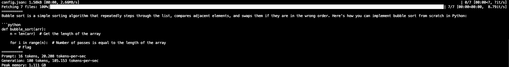
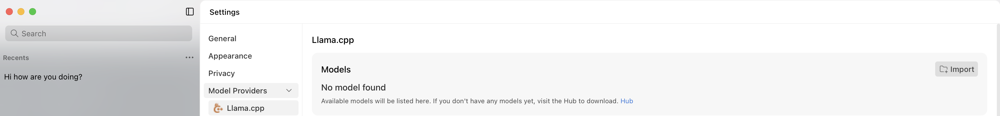
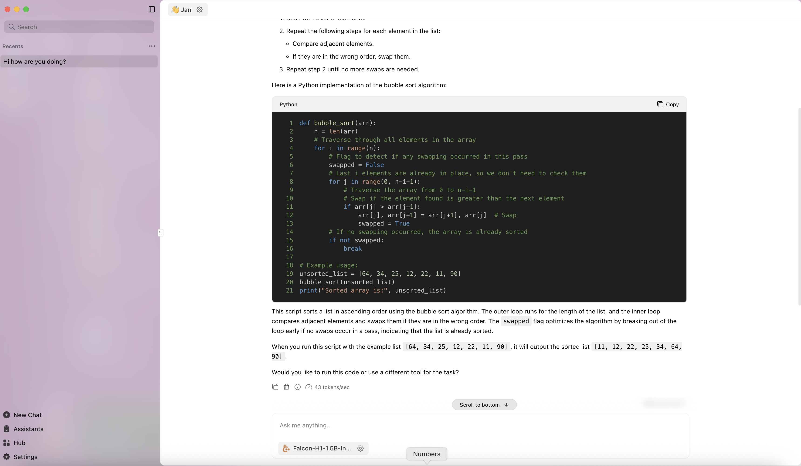

# Deployment

This page summarizes all the currently available tools for deploying **Falcon-H1** models.

> 💡 **Tip:** For optimal performance, always use **`torch.bfloat16`** instead of **`torch.float16`**; The recommended **`model temperature`** is **`0.1`** - higher than that, model's performance may largely drop.

---

### ✅ Supported Frameworks

**Falcon-H1** is compatible with most major inference and deployment frameworks, including:

- [Transformers](#transformers)
- [vLLM](#vllm)
- [SGLang](#sglang)
- [Apple MLX](#apple-mlx)
- [llama.cpp](#llamacpp)
- [SkyPilot](#skypilot)
- [LM Studio](#lm-studio)
- [Jan](#jan)
- [Docker Model API](#docker-model-api)

---

If you encounter any issues or require additional support, please open an issue on our [GitHub repository](https://github.com/tiiuae/Falcon-H1/issues).

---

## Transformers

We advise users to install Mamba-SSM from our public fork in order to include [this fix](https://github.com/state-spaces/mamba/pull/708). Note this is optional as we observed that the issue occurs stochastically. 

```bash
git clone https://github.com/younesbelkada/mamba.git && cd mamba/ && pip install -e . --no-build-isolation
```

Check [this issue](https://github.com/state-spaces/mamba/pull/708) for more details.


Make sure to install `transformers` library from source:

```bash
pip install git+https://github.com/huggingface/transformers.git
```

And use `AutoModelForCausalLM` interface, e.g.:

```python
import torch
from transformers import AutoModelForCausalLM, AutoTokenizer

model_id = "tiiuae/Falcon-H1-1B-Base"

model = AutoModelForCausalLM.from_pretrained(
  model_id,
  torch_dtype=torch.bfloat16,
  device_map="auto"
)

# Perform text generation
```

## vLLM

For vLLM, simply start a server by executing the command below:

```bash
# pip install vllm
vllm serve tiiuae/Falcon-H1-1B-Instruct --tensor-parallel-size 2 --data-parallel-size 1
```

**💡 Tip:** Falcon-H1’s default `--max-model-len` is **262 144** tokens to support very long contexts, but that large window can slow throughput. Set `--max-model-len <prompt_len + output_len>` (e.g. `32768`) and cap concurrency with `--max-num-seqs <N>` (e.g. `64`) to avoid over-allocating KV-cache memory and speed up generation.

## SGLang

[SGLang](https://github.com/sgl-project/sglang) provides a high-performance serving runtime with native Falcon-H1 kernels.
Follow the steps below to spin up a Falcon-H1 endpoint:

```bash
# 1. Install the runtime (requires an NVIDIA GPU with FlashInfer-compatible CUDA drivers)
pip install uv
uv pip install "sglang[all]>=0.5.3"

# 2. Launch Falcon-H1 with SGLang (replace <your_token> with a Hugging Face token)
HF_TOKEN=<your_token> python -m sglang.launch_server \
  --model-path tiiuae/Falcon-H1-7B-Instruct \
  --host 0.0.0.0 \
  --port 30000 \
  --trust-remote-code
```

You can now call the OpenAI-compatible endpoint exposed on `http://localhost:30000`:

```bash
curl http://localhost:30000/v1/chat/completions \
  -H "Content-Type: application/json" \
  -d '{
    "model": "tiiuae/Falcon-H1-7B-Instruct",
    "messages": [
      {"role": "system", "content": "You are Falcon-H1."},
      {"role": "user", "content": "Give me a fun fact about falcons."}
    ]
  }'
```

## Apple MLX

Falcon-H1 is natively supported into Apple MLX ! Simply do:

```
pip install -U mlx-lm
```

Then run:

```
mlx_lm.generate --model tiiuae/Falcon-H1-0.5B-Instruct --prompt "Implement bubble sort from scratch" --max-tokens 100 --temp 0.7
```



<a name="llamacpp"></a>
## llama.cpp

Falcon-H1 is natively supported into `llama.cpp` !

All official GGUF files can be found on [our official Hugging Face collection](https://huggingface.co/collections/tiiuae/falcon-h1-6819f2795bc406da60fab8df).

---

#### 1. Prerequisites

* **CMake** ≥ 3.16
* A **C++17**-compatible compiler (e.g., `gcc`, `clang`)
* **make** or **ninja** build tool
* (Optional) **Docker**, for OpenWebUI integration

---

#### 2. Clone & Build

```bash
# Clone the Falcon-H1 llama.cpp fork
git clone https://github.com/ggml-org/llama.cpp
cd llama.cpp

# Create a build directory and compile
mkdir build && cd build
cmake ..         # Configure the project
make -j$(nproc)  # Build the binaries
```

> Tip: For GPU acceleration, refer to the llama.cpp [GPU guide](https://github.com/ggerganov/llama.cpp#gpu-support).

---

#### 3. Download a GGUF Model

Fetch the desired Falcon-H1 checkpoint from Hugging Face’s collection:

```bash
# Example: download the 1B Instruct model
wget https://huggingface.co/tiiuae/Falcon-H1-1.5B-Instruct-GGUF/resolve/main/Falcon-H1-1.5B-Instruct-Q5_K.gguf \
     -P models/
```

> All available GGUF files: [https://huggingface.co/collections/tiiuae/falcon-h1-6819f2795bc406da60fab8df](https://huggingface.co/collections/tiiuae/falcon-h1-6819f2795bc406da60fab8df)

---

#### 4. Run the llama-server

Start the HTTP server for inference:

```bash
./build/bin/llama-server \
  -m models/Falcon-H1-1B-Instruct-Q5_0.gguf \  
  -c 4096 \                # Context window size
  --ngl 512 \              # Number of GPU layers (omit if CPU-only)
  --temp 0.1 \             # Sampling temperature
  --host 0.0.0.0 \         # Bind address
  --port 11434             # Listening port
```

#### 5. Web UI via OpenWebUI
Use the popular OpenWebUI frontend to chat in your browser:

```bash
docker run -d \
  --name openwebui-test \
  -e OPENAI_API_BASE_URL="http://host.docker.internal:11434/v1" \
  -p 8888:8888 \
  ghcr.io/open-webui/open-webui:main
```

1. Open your browser at [http://localhost:8888](http://localhost:8888)
2. Select **Falcon-H1-1B-Instruct-Q5\_0** from the model list
3. Start chatting!

---

> For advanced tuning and custom flags, see the full llama.cpp documentation: [https://github.com/ggerganov/llama.cpp](https://github.com/ggerganov/llama.cpp)


#### Demo


We use a MacBook M4 Max Chip and Falcon-H1-1B-Q6_K for this demo.

## SkyPilot

Refer to [this documentation section](https://github.com/skypilot-org/skypilot/tree/master/llm/falcon_h1) for deploying Falcon-H1 series models using Skypilot library.

## Lm-studio

First, install lm-studio from [the official website](https://lmstudio.ai/) - make sure to select the latest `llama.cpp` runtime by selecting Developer mode -> "LM Runtimes" (from top left) -> Make sure that `llama.cpp` version is greater than `v1.39.0`


## Jan

Jan is an open source alternative to ChatGPT that runs 100% offline on your computer - it also support H1 models with minimal configuration steps. First make sure to install the version >=0.6.5, then Navigate to Settings -> Model Providers -> Llama.cpp



From there, click on the folder icon to import your own GGUF file and select any H1 GGUF model that you have downloaded locally. After that, switch to the main screen and start chatting with the model !



## Docker Model API

Docker supports deploying local models with a simple API, you can use Falcon-H1 with Docker Model API starting from Docker Desktop version 4.43.2. 

First make sure to run docker desktop (for Mac devices), then run:

```bash
docker model run hf.co/tiiuae/Falcon-H1-1.5B-Instruct-GGUF
```

